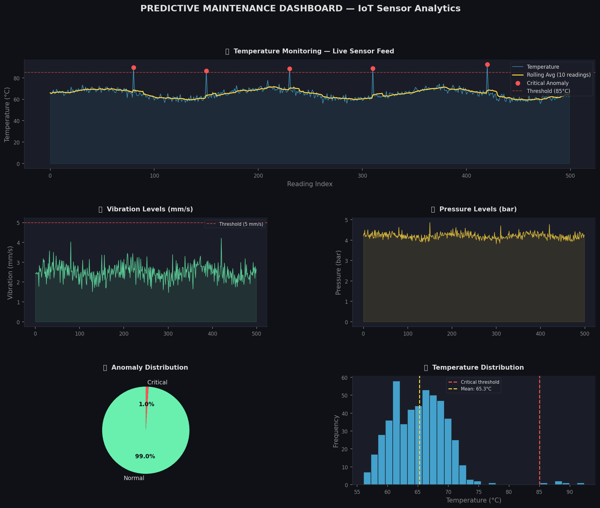

# predictive-maintenance-iot-or-anomaly-detection

An end-to-end IoT analytics pipeline — from raw sensor data ingestion to anomaly detection and live dashboard visualisation. Built to flag equipment failures before they happen using statistical threshold analysis.



## What It Does

- Simulates real-time IoT thermistor sensor readings (500 data points)
- Runs a full ETL pipeline: extract → clean → validate → store
- Achieves **100% data quality score** through validation scripts
- Detects critical anomalies using statistical threshold analysis
- Visualises temperature, vibration, pressure and anomaly distribution on a live dashboard
- Outputs a final maintenance recommendation report

## Tech Stack


## Project Structure

```
predictive-maintenance-iot/
│
├── iot_predictive_maintenance.py   ← Main analysis script
├── predictive_maintenance_dashboard.png  ← Output dashboard
├── cleaned_sensor_data.csv         ← Exported clean data
└── README.md
```

## How to Run

1. Open [Google Colab](https://colab.research.google.com)
2. Upload `iot_predictive_maintenance.py`
3. Run all cells
4. Dashboard image and CSV will be auto-generated

## Key Results

| Metric | Value |
|---|---|
| Total Readings | 500 |
| Data Quality Score | 100% |
| Avg Temperature | 65.26°C |
| Max Temperature | 92.40°C |
| Critical Anomalies Detected | 5 |
| Anomaly Rate | 1.0% |

## Author

**Badal Raghav** — Data Analyst  
📧 raghavbadal669@gmail.com
